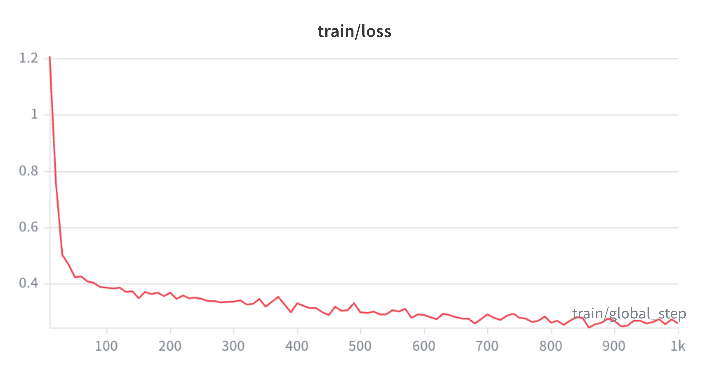

# Concise-CoT

Length-controlled reasoning distillation from `Qwen/Qwen3-32B` into a compact `Qwen/Qwen3-4B` student.

The project trains one student model to follow explicit reasoning budgets:

- `L0`: full reasoning
- `L1`: light compression
- `L2`: medium compression
- `L3`: strong compression

The goal is to measure the accuracy-vs-token Pareto curve and test whether compression removes decorative reasoning before load-bearing calculation.

## Training Curve

bf16 LoRA SFT was tracked in W&B under `qwen3-4b-budget-sft-full-1000`.



## Final Results

Final fixed GSM8K test evaluation used vLLM LoRA inference with `checkpoint-1000`.

| Budget | Accuracy | Mean Generated Tokens | Count |
|---|---:|---:|---:|
| `L0` | 0.9356 | 496.7 | 1319 |
| `L1` | 0.8506 | 350.6 | 1319 |
| `L2` | 0.8878 | 99.0 | 1319 |
| `L3` | 0.8484 | 79.7 | 1319 |

Main insight: `L0` is the accuracy ceiling, while `L2` is the best compressed Pareto point: 88.8% accuracy at about 99 generated tokens.

## RQ2: What Gets Removed?

Structural analysis on the budgeted traces supports decorative-first compression:

| Budget | Mean Token Ratio | Mean Step Ratio | Removed Calc-Like Steps | Removed Prose-Like Steps |
|---|---:|---:|---:|---:|
| `L1` | 0.653 | 0.589 | 0.538 | 0.825 |
| `L2` | 0.179 | 0.192 | 0.697 | 0.970 |
| `L3` | 0.137 | 0.102 | 0.892 | 0.995 |

Prose-like reasoning is removed more aggressively than calculation-like reasoning at every budget. This is structural evidence, not full causal proof.

## Pipeline

1. Generate verified teacher traces from GSM8K train with `Qwen/Qwen3-32B` and vLLM.
2. Rewrite each correct trace into `L1/L2/L3` budgeted versions and re-verify correctness.
3. Convert budgeted traces into chat-style SFT rows.
4. Train `Qwen/Qwen3-4B` with bf16 LoRA SFT.
5. Evaluate the adapter on GSM8K test with vLLM LoRA inference.
6. Build Pareto artifacts and RQ2 structural-removal artifacts.

## Repository Layout

```text
configs/default.yaml              # model, generation, training, and eval config
src/concise_cot/
  config.py                       # typed YAML config loading
  data.py                         # data records and SFT formatting
  verify.py                       # answer extraction and equivalence checks
  gen_teacher.py                  # vLLM teacher trace generation
  compress.py                     # rewrite-to-budget compression
  train.py                        # bf16 LoRA SFT entry point
  eval.py                         # vLLM/HF adapter eval and W&B logging
  tts_score.py                    # RQ2 structural removal analysis
  make_report_artifacts.py        # Pareto CSV/Markdown artifacts
  inspect_jsonl.py                # JSONL inspection helper
  sample_adapter.py               # quick adapter sampling helper
report/report.md                  # final write-up
learning.md                       # detailed experiment log
asset/                            # README/report images
tests/                            # unit tests for pipeline utilities
```

Generated outputs, checkpoints, and copied VM artifacts are ignored by git.

## Setup

Install ROCm PyTorch and ROCm vLLM explicitly for the target MI300X environment. Then install this project without replacing the ROCm stack:

```bash
python -m pip install --no-deps -e ".[dev]"
```

For local utility tests without the GPU stack:

```bash
PYTHONPATH=src python -m pytest tests -q
```

## Key Commands

Convert budgeted traces to SFT rows:

```bash
python -m concise_cot.data \
  --input data/budgeted/gsm8k_qwen3_32b_budgeted_full.jsonl \
  --output data/budgeted/gsm8k_qwen3_32b_sft_full.jsonl
```

Train the student adapter:

```bash
python -m concise_cot.train \
  --config configs/default.yaml \
  --train-jsonl data/budgeted/gsm8k_qwen3_32b_sft_full.jsonl \
  --output-dir ckpts/concise-cot-qwen3-4b-full \
  --max-steps 1000 \
  --run-name qwen3-4b-budget-sft-full-1000
```

Evaluate with vLLM:

```bash
python -m concise_cot.eval \
  --config configs/default.yaml \
  --adapter ckpts/concise-cot-qwen3-4b-full/checkpoint-1000 \
  --source gsm8k \
  --budgets L0 L1 L2 L3 \
  --max-new-tokens 2048 \
  --output outputs/gsm8k_checkpoint1000_eval_fixed_vllm.jsonl \
  --summary-output outputs/gsm8k_checkpoint1000_eval_fixed_vllm.summary.json
```

Use a high enough generation cap for `L0`; under-capping full reasoning can artificially depress `L0` accuracy.

Run RQ2 structural analysis:

```bash
python -m concise_cot.tts_score \
  --input data/budgeted/gsm8k_qwen3_32b_budgeted_full.jsonl \
  --summary-csv outputs/rq2_structural_summary.csv \
  --validation-sample outputs/rq2_causal_validation_sample.jsonl
```

Create report artifacts:

```bash
python -m concise_cot.make_report_artifacts \
  --eval-summary outputs/gsm8k_checkpoint1000_eval_fixed_vllm.summary.json \
  --pareto-csv outputs/plots/gsm8k_pareto.csv \
  --pareto-markdown outputs/plots/gsm8k_pareto.md
```

## W&B Runs To Link

Add these to the project README/report:

- Project: `ishagarg-research/concise-cot`
- Training run: `qwen3-4b-budget-sft-full-1000`
- Fixed eval run: `gsm8k-checkpoint1000-vllm-fixed-eval`

The training run contains bf16 LoRA SFT loss and token-accuracy curves. The fixed eval run contains the budget-wise accuracy/token metrics and Pareto plot.

## Limitations

- GSM8K is the completed benchmark; MATH-500 remains a useful harder follow-up.
- RQ2 is structural evidence, not full causal proof.
- Evaluation caps matter: under-capping `L0` can make full reasoning look artificially weak.
